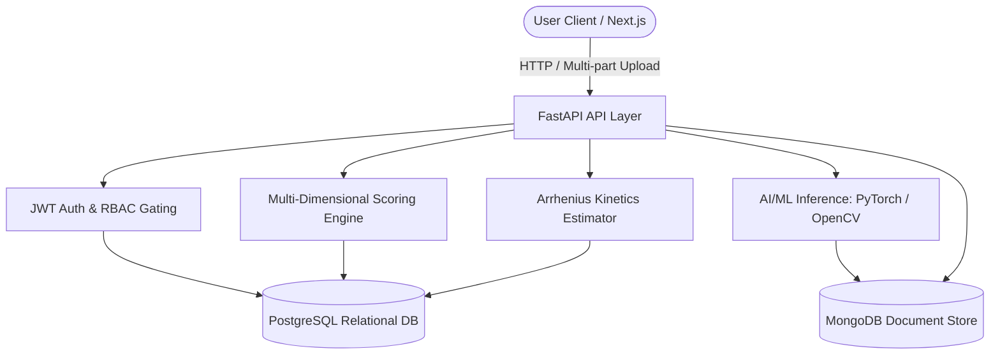

# FreshLens - AI-Powered Food Freshness Monitoring Platform

FreshLens is an enterprise-grade food freshness monitoring and inventory management platform. It integrates visual computer vision scanners, time-series storage telemetry monitoring, predictive shelf-life modeling, and role-based notifications to automate FEFO (First Expired, First Out) dispatch management, helping warehouses and retail stores optimize operations and reduce organic waste.

---

## 1. System Architecture



---

## 2. Key Features

* **Real AI Visual Scanner**: Decoupled pre-processing, CNN inference, and post-processing with low-confidence overrides.
* **Storage Telemetry Logging**: Track zone climates (temperature, humidity, air circulation, light levels) in MongoDB.
* **Arrhenius Shelf-Life Modeling**: Real-time estimations based on environmental kinetics.
* **FEFO Dispatch Management**: Automatically prioritized list of items sorted by remaining shelf life.
* **Dynamic Analytics Reports**: Exposes endpoints exporting PDF and Excel sheets of storage histories and compliance parameters.
* **Production Gated Security**: Hashed passwords, jwt tokens, strict MIME-type guards, and generic global error catchers.

---

## 3. Tech Stack

* **Frontend**: Next.js (App Router, dynamic concentrics, perspective tilt animations).
* **Backend**: FastAPI (Python 3.13, SQLAlchemy, Beanie ODM, rate limiters).
* **Databases**:
  * **PostgreSQL**: Manages structured transactional data (Users, Batches, Items).
  * **MongoDB**: Tracks time-series data (Scans, Readings, System Alerts).

---

## 4. Local Installation & Development

Ensure you have **Python 3.13** and **Node.js 20+** installed.

### 1. Configure the Environment
Create a `.env` file inside the `backend` folder using the root `.env.example` as a template:
```bash
cp .env.example backend/.env
```

### 2. Backend Local Setup
From the root directory:
```powershell
cd backend
python -m venv .venv
.venv\Scripts\Activate.ps1
pip install -r requirements.txt -r requirements-dev.txt
python -m uvicorn app.main:app --reload
```
* **Interactive OpenAPI docs**: [http://localhost:8000/docs](http://localhost:8000/docs)
* **Backend Health Check**: [http://localhost:8000/health](http://localhost:8000/health)

### 3. Frontend Local Setup
From another terminal:
```powershell
cd frontend
npm install
npm run dev
```
* **Dashboard Portal**: [http://localhost:3000](http://localhost:3000)

### 4. Run Automated Tests
With the virtual environment active in the `backend` folder:
```powershell
python -m pytest app/tests/ -v
```

### 5. Seeding Demo Accounts
Set up Apples, Bananas, Potatoes, Tomatoes, Oranges and test accounts (Consumer, Retail Manager, Warehouse Operator) by running:
```powershell
python scripts/seed_demo_data.py
```

---

## 5. Deployment with Docker Compose

You can launch the complete, connected stack from scratch by running:
```bash
docker compose up --build
```
This builds and orchestrates:
- PostgreSQL on port `5432`
- MongoDB on port `27017`
- FastAPI Backend on port `8000`
- Next.js Web Client on port `3000`

---

## 6. Monorepo Layout

```text
d:\FreshLens\
├── docker-compose.yml        # Multi-container orchestration (Postgres, Mongo, API, UI)
├── README.md                 # Setup, run, and test guide
├── .env.example              # Centralized environment template
├── docs/                     # Documentation files
│   ├── VIVA.md               # Quick exam prep guide
│   └── PROJECT_STATUS.md     # Feature implementation log
├── backend/                  # FastAPI Backend service
│   ├── Dockerfile
│   ├── requirements.txt      # Dependencies
│   ├── app/                  # Core codebase
│   │   ├── core/             # DB setups, configs, rate-limiters
│   │   ├── modules/          # Business rules routers (Auth, Inventory, AI)
│   │   └── tests/            # Pytest test cases
│   └── scripts/              # Demo dataset seed scripts
└── frontend/                 # Next.js App Router client
    ├── Dockerfile
    └── src/app/              # UI Dashboards (Consumer, Retail, Warehouse)
```
