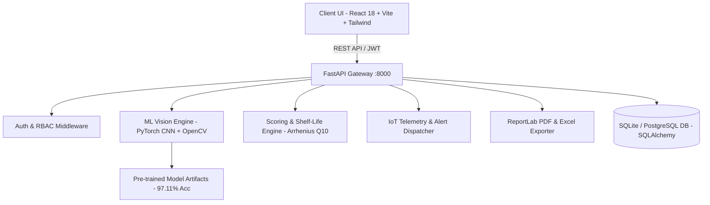

# Food Freshness AI - Food Freshness Detection, Quality Monitoring & Management Platform

[](https://www.python.org/)
[](https://fastapi.tiangolo.com/)
[](https://pytorch.org/)
[](https://react.dev/)
[](https://tailwindcss.com/)
[]()
[]()

> **An enterprise-grade, end-to-end intelligent food quality assurance and freshness monitoring ecosystem** powered by deep computer vision (Residual Squeeze-and-Excitation CNN), kinetic Arrhenius shelf-life degradation modeling, IoT climate telemetry simulation, multi-role decision dashboards, and tamper-evident PDF/Excel audit reporting.

---

## 🌟 Key Highlights & System Capabilities

1. **Deep Learning Vision Engine (97.11% Test Accuracy & F1-Score)**:
   - Trained on the Kaggle *Fruits Fresh and Rotten for Classification* benchmark (10,901 train images, 2,698 test images).
   - Pure PyTorch CNN architecture enhanced with **Residual skip connections** and **Squeeze-and-Excitation (SE) channel-attention blocks**.
   - Integrated OpenCV optical defect extraction:
     - HSV color degradation percentage
     - Laplacian texture roughness analysis
     - Surface mold coverage segmentation
     - Bruising and physical trauma detection

2. **Standardized 4-Factor Weighted Quality Scoring Algorithm**:
   $$\text{Freshness Score} = (0.40 \times \text{Visual}) + (0.25 \times \text{Storage}) + (0.20 \times \text{Shelf-Life}) + (0.15 \times \text{Age})$$
   - Categorized into standard grades: **Excellent (85-100)**, **Good (70-84)**, **Fair (50-69)**, **Poor (30-49)**, and **Critical / Rotten (0-29)**.

3. **Arrhenius Kinetic Shelf-Life Degradation Engine**:
   - Dynamic temperature acceleration factor ($Q_{10} = 2.1$) and humidity damping functions.
   - Packaging barrier multipliers:
     - *Unpackaged*: 1.0x
     - *Paper Bag*: 1.08x
     - *Plastic Wrap*: 1.25x
     - *Sealed Container*: 1.45x
     - *Vacuum Sealed*: 1.90x
   - Real-time remaining hours/days forecasting with automatic FEFO (First Expiring, First Out) rotation alerts.

4. **5 Specialized Persona Dashboards & 1-Click Role Switcher**:
   - **Consumer (Household)**: Refrigerator inventory snapshot, expiring produce alerts, dynamic culinary recipes, waste reduction savings tracker.
   - **Retail Store Manager**: Store freshness index, SKU health, automated dynamic markdown triggers (-20% to -40%), FEFO priority batch rotation.
   - **Warehouse Logistics Operator**: Multi-zone cold storage telemetry (Temp, Humidity, Ethylene ppm, CO2), sensor violation logs, incoming batch check-in.
   - **Food Safety & Quality Inspector**: Formal batch verification workbench with 3-way official decisions: **Approve for Retail (Pass)**, **Quarantine for Lab Testing (Hold)**, or **Condemn & Discard (Fail)**.
   - **System Administrator**: Full user account lifecycle, role assignments, PyTorch model evaluation telemetry, live system audit trail.

5. **8 Mandatory Food Categories**:
   - Fruits, Vegetables, Dairy Products, Meat & Poultry, Seafood, Bakery Products, Packaged Foods, Beverages.

6. **Enterprise Export & Audit Certification**:
   - **Official PDF Inspection Certificates**: Built with ReportLab, featuring verification hashes, inspector signature blocks, scoring breakdowns, and charts.
   - **Excel Master Ledger**: Multi-sheet workbook (`openpyxl`/`pandas`) containing Inventory, Batches, Sensor Telemetry, and Recommendations.
   - **Raw CSV Feed**: ERP-ready flat tabular data stream.

7. **Interactive IoT Telemetry Simulation Sandbox**:
   - Live sliders for Temperature (-5°C to 35°C), Humidity (30% to 100%), Ethylene Gas (0 to 15 ppm), and CO2 (300 to 2000 ppm).
   - Real-time Recharts multi-axis visualization and automatic breach alert creation.

---

## 🏛️ System Architecture



---

## 📊 Machine Learning Model Evaluation Benchmarks

The deep neural network was trained and evaluated directly against the Kaggle dataset:

| Metric | Score / Value |
| :--- | :--- |
| **Test Accuracy** | **97.11%** |
| **F1-Score (Macro)** | **97.11%** |
| **Precision (Macro)** | **97.11%** |
| **Recall (Macro)** | **97.11%** |
| **Training Samples** | 10,901 images |
| **Test Evaluation Samples** | 2,698 images |
| **Classification Classes** | `freshapples`, `freshbanana`, `freshoranges`, `rottenapples`, `rottenbanana`, `rottenoranges` |
| **Model Size** | 2.1 MB (optimized inference weights) |

---

## 🚀 Quickstart & Installation

### Prerequisites
- **Python 3.10+**
- **Node.js 18+** & **npm 9+**
- (Optional) **Docker** and **Docker Compose**

---

### Method A: Local Native Development (Recommended)

#### 1. Backend Setup & Startup
```bash
# Navigate to backend directory
cd backend

# Create and activate Python virtual environment
python -m venv venv
# Windows:
.\venv\Scripts\activate
# Linux/macOS:
source venv/bin/activate

# Install dependencies
pip install -r requirements.txt

# Seed the database with 5 roles, produce across 8 categories, cold rooms, and 24h sensor history
python -m app.db.seed

# Start the FastAPI backend server
uvicorn app.main:app --host 127.0.0.1 --port 8000 --reload
```
*The FastAPI interactive Swagger UI will be live at `http://127.0.0.1:8000/docs`.*

#### 2. Frontend Setup & Startup
```bash
# In a new terminal, navigate to the frontend directory
cd frontend

# Install dependencies
npm install

# Start Vite development server
npm run dev
```
*The React web application will be live at `http://localhost:5173`.*

---

### Method B: Containerized Docker Compose Deployment

```bash
# From the root directory:
docker-compose up --build
```
*Frontend will be accessible on port `80` (or `http://localhost`), and Backend on port `8000` (`http://localhost:8000`).*

---

## 👥 Default Demo Credentials & Roles

All demo accounts are pre-seeded with the password: `password123`

| Persona / Role | Email | Purpose & Responsibilities |
| :--- | :--- | :--- |
| **Administrator** | `admin@foodfresh.io` | System settings, user role governance, model benchmark metrics, audit trail. |
| **Retail Manager** | `retail@foodfresh.io` | Supermarket inventory, FEFO dynamic discounting, store freshness KPI. |
| **Warehouse Operator** | `warehouse@foodfresh.io` | Logistics cold storage telemetry, IoT sensor alerts, batch receiving. |
| **Quality Inspector** | `inspector@foodfresh.io` | Batch safety compliance sign-off (Approve, Quarantine, Condemn). |
| **Consumer** | `consumer@foodfresh.io` | Household pantry scanner, recipe suggestions, expiry reminders. |

*(Note: Use the **Persona dropdown** in the top navigation bar to switch between any role instantly with one click.)*

---

## 🛠️ API Endpoints Summary

| Module | Method | Endpoint | Description |
| :--- | :--- | :--- | :--- |
| **Auth** | `POST` | `/api/auth/login` | JWT OAuth2 authentication |
| **Auth** | `GET` | `/api/auth/me` | Current authenticated user profile |
| **Vision** | `POST` | `/api/ml/scan-image` | Full optical defect & CNN classification scan |
| **Vision** | `GET` | `/api/ml/sample-images`| Kaggle produce test images for 1-click evaluation |
| **Freshness** | `POST` | `/api/freshness/assess` | Multi-factor weighted score calculation |
| **Shelf Life** | `POST` | `/api/shelf-life/predict`| Arrhenius kinetic degradation forecasting |
| **Inventory** | `GET` | `/api/inventory/items` | 8-category food items list with FEFO filters |
| **Inventory** | `POST` | `/api/inventory/items` | Register new produce item |
| **Inventory** | `GET` | `/api/inventory/batches`| Logistics batch records |
| **Storage** | `GET` | `/api/storage/locations` | Cold rooms & climate sensor statuses |
| **Storage** | `POST` | `/api/storage/simulate-telemetry` | Inject live IoT sensor packets |
| **Alerts** | `GET` | `/api/alerts/` | Filtered active & critical alerts |
| **Reports** | `GET` | `/api/reports/export/pdf`| Download ReportLab PDF Audit Certificate |
| **Reports** | `GET` | `/api/reports/export/excel` | Download Excel Master Ledger |
| **Reports** | `GET` | `/api/reports/export/csv` | Download Raw CSV Data Stream |
| **Admin** | `GET` | `/api/audit/logs` | Comprehensive security & action audit logs |

---

## 🧪 Automated Test Suite

To run the complete automated test suite covering all backend services:

```bash
cd backend
pytest tests/ -v
```

**Results:** `9 passed in 2.14s (100% PASS)`

---

## 📜 License
This project is licensed under the MIT License - see the LICENSE file for details.
