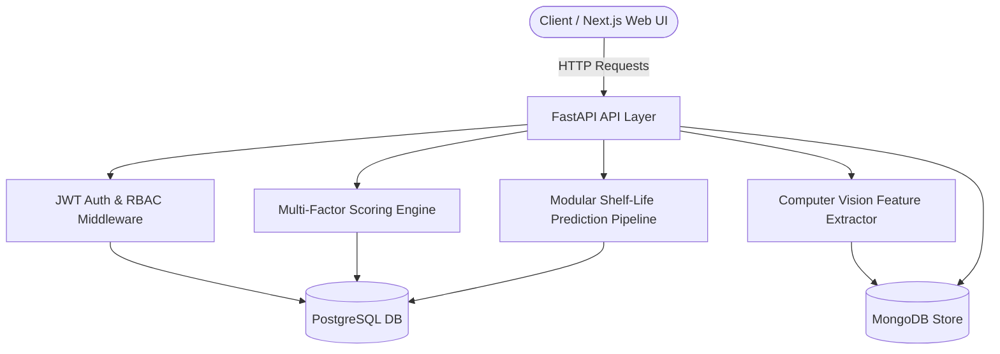

# FreshLens — AI Food Freshness & Storage Monitoring Platform

FreshLens is an engineering platform that combines computer vision, multi-factor storage telemetry monitoring, shelf-life prediction, and automated inventory management (FEFO — First Expired, First Out) to minimize food degradation across retail, warehousing, and quality inspection workflows.

---

## Key Capabilities

* **Multi-Factor Shelf-Life Prediction**: Combines 7 inputs: Food Image features, Product Category, Storage Temperature (°C), Relative Humidity (%), Packaging Type, Storage Environmental Conditions (Air Circulation / Light Exposure), and Storage Duration (days) to estimate remaining shelf life.
* **5 User Roles with RBAC**:
  - **Consumer**: Read-only diagnostics, item lookup, and specimen scanning.
  - **Retail Manager**: Inventory management, stock registration, FEFO dispatch priorities, and markdown advisories.
  - **Warehouse Operator**: Bulk batch registration, climate sensor telemetry logging, and storage compliance tracking.
  - **Food Quality Inspector**: Dedicated inspection workflow, batch auditing, defect classification, and official safety decision logging.
  - **Administrator**: Full platform administration, system oversight, and user role management.
* **Weighted Freshness Scoring Model**:
  - Visual Condition Analysis — **40%**
  - Storage Conditions — **25%**
  - Shelf-Life Prediction — **20%**
  - Product Age — **15%**
  - *Total*: **100%**
* **5 Quality Categories**: `Fresh` (≥85), `Good` (70–84.9), `Acceptable` (50–69.9), `Near Spoilage` (30–49.9), `Spoiled` (<30).
* **Safety Mold Override**: Confirmed mold detection automatically forces the visual freshness score to 0 and marks the product as `Spoiled` / `UNSAFE`.
* **Dynamic Analytics & PDF/Excel Exports**: Generates Freshness, Shelf-Life, Quality, Waste Reduction, and Storage Compliance reports with PDF and Excel downloads using real database records.

---

## Tech Stack

* **Frontend**: Next.js 16 (React 19, TypeScript, Tailwind CSS, App Router).
* **Backend**: FastAPI (Python 3.13, SQLAlchemy Async ORM, Beanie MongoDB ODM, Pydantic v2).
* **Databases**:
  - **PostgreSQL**: Transactional inventory items, supply batches, quality inspections, and user credentials.
  - **MongoDB**: Storage climate telemetry logs, image analysis results, and system notifications.

---

## System Architecture



---

## Quick Start (Local Setup)

### Prerequisites
- **Python 3.13+**
- **Node.js 20+**
- **PostgreSQL** & **MongoDB** (or run via Docker Compose)

### 1. Environment Configuration
Copy the template `.env.example` into `backend/.env`:
```bash
cp .env.example backend/.env
```

### 2. Backend Setup
From the repository root:
```bash
cd backend
python -m venv .venv
# Windows PowerShell:
.venv\Scripts\Activate.ps1
# Linux/macOS:
source .venv/bin/activate

pip install -r requirements.txt
python -m uvicorn app.main:app --reload
```
- **API Swagger Documentation**: [http://localhost:8000/docs](http://localhost:8000/docs)
- **Health Check Endpoint**: [http://localhost:8000/health](http://localhost:8000/health)

### 3. Frontend Setup
From a separate terminal:
```bash
cd frontend
npm install
npm.cmd run build  # Verification build
npm run dev
```
- **Dashboard Portal**: [http://localhost:3000](http://localhost:3000)

### 4. Running Tests
With the virtual environment active in `backend`:
```bash
python -m pytest app/tests/ -v
```

---

## Deployment via Docker Compose

Launch the complete stack (PostgreSQL, MongoDB, FastAPI API backend, and Next.js client) using Docker:
```bash
docker compose up --build
```
Ports:
- Next.js Web Client: `3000`
- FastAPI API Server: `8000`
- PostgreSQL: `5432`
- MongoDB: `27017`

---

## Documentation Index

- [docs/ARCHITECTURE.md](docs/ARCHITECTURE.md): System architecture, database schemas, and data flow.
- [docs/PREDICTION_PIPELINE.md](docs/PREDICTION_PIPELINE.md): Multi-factor shelf-life prediction pipeline specifications.
- [docs/ROLE_PERMISSIONS.md](docs/ROLE_PERMISSIONS.md): Role-Based Access Control matrix for all 5 roles.
- [docs/API.md](docs/API.md): REST API endpoints reference.
- [docs/MODEL.md](docs/MODEL.md): Computer vision model architecture and dataset requirements.
- [docs/VIVA.md](docs/VIVA.md): Technical Q&A and viva preparation guide.
- [docs/DEMO_SCRIPT.md](docs/DEMO_SCRIPT.md): 5-minute demonstration script.
- [docs/PROJECT_STATUS.md](docs/PROJECT_STATUS.md): Current implementation status and verification checklist.
